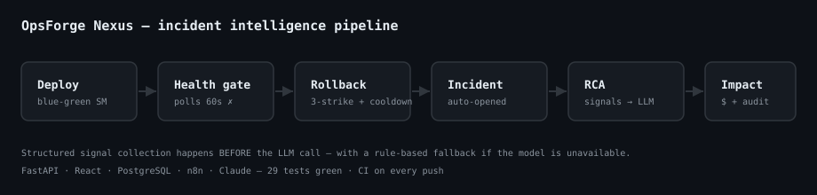

# OpsForge Nexus

**AI-powered release, reliability & incident intelligence platform.**

[](https://github.com/IshaanS0112/OpsForge-Nexus/actions/workflows/ci.yml)



OpsForge simulates a production reliability system: blue-green deployments with
a health-check-gated traffic switch, automatic rollback on concrete thresholds,
z-score anomaly detection, and a **structured** root-cause analysis pipeline
that collects correlated signals *before* it ever calls an LLM.

The state machine, health gate, rollback logic, anomaly detector, and RCA
signal collection are **real engineering**. What is simulated — deliberately and
explicitly — is the underlying infrastructure: there is no Kubernetes cluster,
traffic switching is a flag flip, and health/metric samples come from a
pluggable simulator. That boundary is documented in
[What is real vs simulated](#what-is-real-vs-simulated).

---

## How RCA works — structured signals before the LLM

The RCA engine is signal-driven, not a prompt wrapper. It rests on a strict
**order of operations**:

1. Define a lookback window around the incident.
2. Collect *structured* signals — recent deployment + config diff, z-scored
   metric anomalies, top error signatures (deduplicated & counted), and a
   deployment/anomaly correlation flag.
3. **Only then** call the LLM with a constrained, JSON-only prompt over that
   structured context.
4. Parse and validate the structured JSON response.

If the LLM is unavailable, times out, or returns junk, a **rule-based fallback**
ranks candidates by deployment proximity, so the system degrades gracefully
instead of returning nothing. See
[`backend/app/services/rca_engine.py`](backend/app/services/rca_engine.py).

---

## Architecture

```
 React dashboard ──► FastAPI backend ──► PostgreSQL
                       │  Deployment engine (blue-green state machine)
                       │  Rollback engine (thresholds + anti-flap cooldown)
                       │  Anomaly detector (z-score)
                       │  RCA engine (structured signals ──► LLM ──► ranked)
                       │  Business impact calculator
                       ▼
                      n8n  (webhook ──► fetch ──► RCA ──► impact ──► notify ──► store)
                       ▼
                    Claude API (constrained RCA prompt)
```

Full detail: [`docs/architecture.md`](docs/architecture.md).

---

## Quickstart

### Option A — Docker Compose (everything)

```bash
cp backend/.env.example backend/.env    # optional: add ANTHROPIC_API_KEY
docker compose up --build
```

| Service   | URL                          |
|-----------|------------------------------|
| Dashboard | http://localhost:8080        |
| API docs  | http://localhost:8000/docs   |
| n8n       | http://localhost:5678        |

Without an `ANTHROPIC_API_KEY`, RCA automatically uses the rule-based fallback —
the app is fully functional either way.

### Option B — Backend only (local dev)

```bash
cd backend
pip install -r requirements.txt
export DATABASE_URL="sqlite:///opsforge.db"      # or a local Postgres URL
uvicorn app.main:app --reload
```

### Frontend dev server

```bash
cd frontend
npm install
npm run dev        # http://localhost:5173, proxies /api ──► :8000
```

---

## Try the demo flow

One command runs the whole thing (deploy → fail → rollback → RCA → impact)
against a running backend:

```bash
# Terminal 1 — run the backend (HEALTH_CHECK_FAST makes the gate instant for a demo)
cd backend && HEALTH_CHECK_FAST=1 uvicorn app.main:app

# Terminal 2
./scripts/demo.sh
```

Deployment is **asynchronous**: `POST /deployments` returns `202` immediately
with the record at `IDLE`, and the health gate runs over its polling window in
the background. Poll `GET /deployments/{id}` for the terminal state:

```bash
# 1. Healthy deploy ──► 202, then progresses to LIVE
DEP=$(curl -s -X POST localhost:8000/deployments \
  -H 'content-type: application/json' \
  -d '{"service_name":"checkout","version":"v1.0.0"}' | python3 -c 'import sys,json;print(json.load(sys.stdin)["id"])')
curl -s localhost:8000/deployments/$DEP    # -> status: LIVE

# 2. Bad deploy ──► health gate fails ──► auto-rollback ──► incident opened
curl -X POST localhost:8000/deployments \
  -H 'content-type: application/json' \
  -d '{"service_name":"checkout","version":"v2.0.0","simulate_failure":true}'

# 3. Grab the incident id, then run RCA + impact
curl localhost:8000/incidents
curl -X POST localhost:8000/incidents/<INCIDENT_ID>/trigger-rca
curl localhost:8000/incidents/<INCIDENT_ID>/business-impact
```

Drop `HEALTH_CHECK_FAST` to watch the gate poll over the real 60-second window.
Or drive the anomaly-detector path with the simulated generator:

```bash
python scripts/metric_generator.py --service payments --inject
```

## Capture a real LLM RCA sample

The RCA engine collects structured signals and then calls a real LLM. To capture
that output as a committed sample:

```bash
# backend must run WITH a real key so the LLM path (not the fallback) executes
cd backend && export ANTHROPIC_API_KEY=sk-ant-... && HEALTH_CHECK_FAST=1 uvicorn app.main:app

# then, from the repo root:
python scripts/rca_proof.py      # writes docs/rca_sample.json
```

`rca_proof.py` runs a failing deploy, waits for the auto-created incident, runs
RCA, and saves the ranked candidates to `docs/rca_sample.json`. It warns loudly
if the rule-based fallback was used (i.e. no key), so the committed sample is
always a real model run.

## Record the demo GIF

With the stack up (`docker compose up`), record the dashboard flow with any
screen recorder (macOS: Cmd-Shift-5; or [`vhs`](https://github.com/charmbracelet/vhs)
for a terminal GIF of `scripts/demo.sh`). Save it as `docs/demo.gif` and swap the
banner at the top of this README from `docs/demo.svg` to `docs/demo.gif`.

---

## Tests

```bash
cd backend
pip install -r requirements.txt
pytest
```

28 tests cover the state machine (legal/illegal transitions, health gate),
rollback triggers + cooldown/anti-flap, z-score + streak logic, the RCA
fallback and JSON parsing, the impact formula, and the full API flow. The same
portable ORM runs on SQLite (tests) and PostgreSQL (prod).

---

## What is real vs simulated

| Real engineering | Simulated (V1 scope) |
|---|---|
| Blue-green **state machine** with enforced transitions | No real K8s / cloud infra |
| Health-gate logic (success-rate + p95 + 5xx criteria, 3-strike rule) | Health samples from a pluggable simulator |
| Rollback trigger evaluation + **anti-flap cooldown** | Traffic switch is a flag flip, not a load balancer |
| **Z-score** anomaly detection over rolling windows | Metrics come from a generator, not real telemetry |
| **Structured** RCA signal collection before the LLM | Single service, single tenant |
| Business-impact formula with auditable `calculation_basis` | `revenue_per_request` is a configurable mock |

See [Non-goals](docs/architecture.md#non-goals-v1-scope) for the full scope
boundaries and the V2 roadmap (real K8s, canary %, dependency graph, ML-based
detection).

---

## Design decisions

The key design decisions and their rationale — mapped to where each lives in
code — are in [`docs/architecture.md`](docs/architecture.md#design-decisions).
In short: rollback avoids false positives via sustained-window thresholds and a
post-rollback cooldown; z-score is chosen over fixed thresholds for per-service
adaptivity (tradeoff: needs baseline history, weak under seasonality); RCA is
structured-first with a graceful fallback.

---

## Tech stack

FastAPI · SQLAlchemy · PostgreSQL · React + TypeScript (Vite) · n8n · Claude API
· Docker Compose.

## License

MIT
